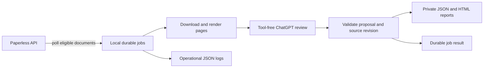

# Architecture and development

[Home](../README.md) · [Operations](operations.md) · [Authentication](authentication.md)

## Boundaries

Paperless owns documents, taxonomy and eligibility tags. The worker reads those
through a GET-only connector; it owns its own durable jobs and audit files.
OpenAI receives selected source evidence and returns a structured proposal. No
model tools, Paperless write endpoints or automatic application path exist.



A job is tied to its source revision and review policy, rather than a mutable
Paperless status tag. `needs review` is eligibility; `receipt to log` belongs to
the receipts workflow and is not a worker completion marker. See
[enrollment](operations.md#document-enrollment) and [review](review.md).

## Code map

| Directory | Responsibility |
| --- | --- |
| `src/PaperlessLlm/Auth` | PKCE browser sign-in, JWT validation, private credential storage and refresh |
| `src/PaperlessLlm/Paperless` | Bounded GET-only API access and PDF/image rendering |
| `src/PaperlessLlm/Inference` | Official OAuth Responses endpoint, streamed completion, no tools |
| `src/PaperlessLlm/Review` | Prompt, strict local validation, escaped private evidence reports |
| `src/PaperlessLlm/Worker` | Enrollment, polling, durable job lifecycle and retries |
| `src/PaperlessLlm/Program.cs` | Commands, environment configuration and Generic Host wiring |
| `tests/PaperlessLlm.Tests` | Synthetic failure-mode and invariant tests |

The product has no Python dependency. PDF rendering uses Poppler bundled in the
image. Native development requires Poppler only when testing real PDF rendering.

## Develop

Install the .NET SDK specified in [global.json](../global.json), then:

```sh
dotnet restore --locked-mode
dotnet test -c Release --no-restore --tl:off
dotnet run --project src/PaperlessLlm -- --help
docker build -t ppllm:local .
docker run --rm --read-only --tmpfs /tmp ppllm:local --version
```

CI runs tests on Windows, macOS and Linux, and builds/smoke-tests the Linux
container. Releases add both amd64 and arm64 images. See the
[release skill](../.agents/skills/release/SKILL.md) for publication and anonymous
pull verification.

## Security and consistency

Documents, OCR, taxonomy names and model output are untrusted. Model requests
have no executable tools. Proposals must conform to the schema and known taxonomy;
protected workflow tags cannot be proposed. The connector validates pagination
boundaries and does not follow redirects with credentials. Source changes during
inference invalidate the result. Audit output is committed before job completion.

Credential, state and audit volumes are private and separate. Container stdout
contains operational events rather than document bodies. This reduces accidental
logging exposure; it does not make model proposals factually reliable. Human
review remains the accuracy check.
